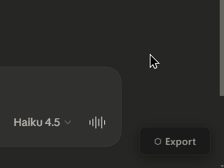

# Claude Keeper

[](https://github.com/kjerk/claude-keeper/actions/workflows/on-push-check.yml)
[](https://github.com/kjerk/claude-keeper/releases/latest)
[](https://www.gnu.org/licenses/gpl-3.0)
[](https://github.com/kjerk/claude-keeper)
[](https://github.com/kjerk/claude-keeper)
[](https://github.com/kjerk/claude-keeper)

An UNOFFICIAL local-first conversation viewer for exported Claude AI chats. Everything runs in a single standalone HTML file -- no server, no accounts, no telemetry. Your data never leaves your machine. The concept is that you are in control of your data -- forever.

There's also a companion Tampermonkey userscript that adds an export button directly to conversations.

https://github.com/user-attachments/assets/c561a4e2-7b00-424f-8427-50628fbf79e4

## Features

**Viewer** (the HTML file)
- Drag and drop any exported conversation JSON to view it
- Full markdown rendering with syntax-highlighted code blocks
- Conversation branching -- navigate alternate responses with branch controls
- Collapsible thinking blocks and tool-use blocks
- Attachment side panel with copy/save
- Copy buttons on messages and code blocks
- Six built-in themes (dark, light, zenburn, monokai, solarized dark/light)
- Theme preference persisted in localStorage
- Works offline, works forever -- it's just an HTML file

**Userscript** (for exporting from claude.ai)



- Adds an "Export" button to any conversation on claude.ai
- Keyboard shortcut: Ctrl+E (Cmd+E on Mac)
- Downloads the full conversation tree as JSON, including attachments and metadata
- Installs via Tampermonkey or any compatible userscript manager


## Usage

**Viewing a conversation:**
1. Download `claude-keeper.html` from the [latest release](../../releases/latest)
2. Open it in a browser
3. Drag a conversation JSON file onto the page (or click "Choose file")

You can drop a new file at any time to replace the current conversation.

Two builds are available: the full version (~220KB) is completely offline with all dependencies inlined, and the lite version (~53KB) loads marked and highlight.js from CDN at runtime.

**Exporting from claude.ai:**
1. Install one of:
   - [Tampermonkey](https://www.tampermonkey.net/)
   - [Violentmonkey](https://violentmonkey.github.io/)
   - Safari: [Userscripts for Safari](https://apps.apple.com/us/app/userscripts/id1463298887) ([Github](https://github.com/quoid/userscripts))
2. Install `claude-keeper.user.js` from the [latest release](../../releases/latest)
3. Open any conversation on claude.ai -- an "Export" button appears in the bottom-right corner
4. Click the button (or press Ctrl+E) to download the conversation as JSON


## Building from Source

The build has no npm dependencies. It uses a vendored esbuild binary in `bin/` to bundle the ES modules, then an awk rule to assemble everything into a single HTML file.

```bash
bash build.sh
```

This produces two files in `dist/`:
- `claude-keeper.html` -- fully offline, all vendor libraries inlined
- `claude-keeper-lite.html` -- app code inlined, vendor libraries load from CDN

The inlining mechanism is driven by `data-local` attributes in `viewer/index.html`. Any `<script>` or `<link>` tag with a `data-local="path"` attribute gets replaced with the file contents inlined. In the lite build, vendor paths are skipped and the CDN `src`/`href` is used instead.

The esbuild binaries in `bin/` are committed directly -- one for Linux (used in CI), one for Windows (for local dev). This is intentional: the build should work without npm, without npx, without anything other than the git clone.


## Development

npm is only used for linting, not building:

```bash
npm install      # one-time: pulls eslint
npm run lint     # lint viewer/src/ and userscript/
```

### Module structure

The viewer source lives in `viewer/src/` as four ES modules:

| File | Responsibility |
|------|----------------|
| `main.js` | App shell, event delegation, theme system, drag/drop, file loading |
| `conversation.js` | Data model -- parses the JSON tree, manages branch state, builds the active path |
| `render.js` | Markdown setup (marked + hljs), message/block HTML generation, incremental re-render |
| `panel.js` | Attachment side panel -- open/close, copy, save, resize |

During development, open `viewer/index.html` via a local server (modules require it). The CDN tags load the vendor libraries directly. The build step is only needed to produce the single-file distributions.

## Themes

Themes are defined as `[data-theme="name"]` blocks in `viewer/style.css`. The viewer discovers them automatically at runtime by scanning the stylesheet for these selectors and reading their `--theme-label` and `--theme-type` CSS custom properties.

To add a theme:
1. Add a new `[data-theme="your-theme"]` block to `style.css`
2. Set `--theme-label` (display name) and `--theme-type` (`"dark"` or `"light"`)
3. Define all the color variables (copy an existing theme block as a starting point)

That's it -- the theme picker will find it automatically.


## License

GPL-3.0 - See [LICENSE](LICENSE)
